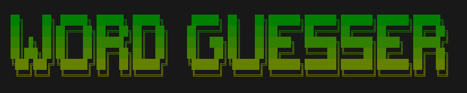
# Word Guesser Game
**Nick Fahey | 2025-JUN**  
https://github.com/N-Fahey/Coder_DEV1001_ASGMT_2  
Coder Academy DEV1001 Assignment 2: Custom Software Application    

## Description
This is a simple Python reimagining of popular word guessing game Wordle, by Josh Wardle. Like the original, players have 6 attempts to guess a 5 letter word.

## Requirements
* Windows, Linux or Mac
* Python 3.12 or greater
* External libraries (see requirements.txt list)

## Installation
1. [Install Python](https://www.python.org/about/gettingstarted/) on your Windows, Mac, or Linux machine
2. Ensure PIP is installed by running:  
`pip --version`
3. Use pip to install requirements by running:  
`pip install -r requirements.txt`

## Usage

### First run
Ensure all [requirements](#requirements) are met and [installation](#installation) steps are completed.  
Depending on your installation, run one of the following commands to launch the program:  
`python3 main.py`  
`python main.py`  
The program will create the required user file on first launch, this will be noted in the terminal:  
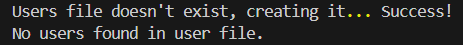

### Main Menu
The primary functions of the program are visible only once a user has logged. The first menu you will see will contain 3 options:
1. Login
2. Create new user
3. Exit

To use the menu, simply type the number of the selected option after the '>>>' prompt, and press enter
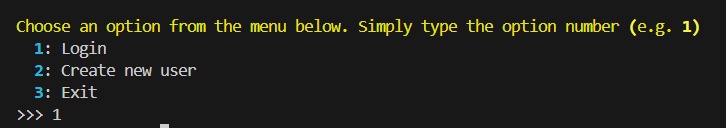

#### Login Option
The login option allows logging in to an existing user.  
*Note: You will need to use option 2. Create new user first!*  
* After selecting the login option, enter your username when prompted:  
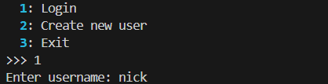
* Followed by your password  
*Note: Your password will be hidden as entered*

* If login succeeds, you will see the full menu:  
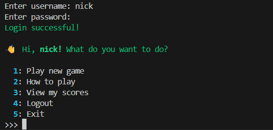

* If login fails, you will return to the first menu:  
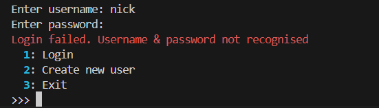

#### Create New User Option
This option allows creation of a new user login.
* Enter your chosen username when prompted.  
*Usernames must be unique! If one already exists, you will be prompted to try again:*  
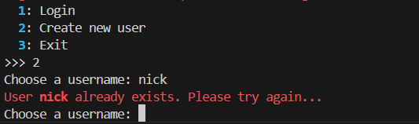
* Enter your chosen password
* When user is created succesfully, you'll then be able to [log in](#login-option)  
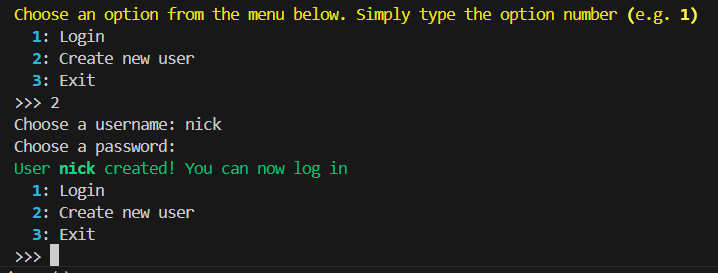

#### Exit Option
To quit the program at any time, choose the exit option  
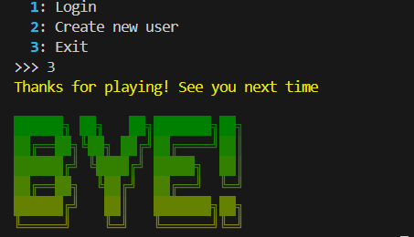

### Logged In Menu
Once you've logged in, you'll see full menu options:  
1. Play new game
2. How to play
3. View my scores
4. Logout
5. Exit

#### Play New Game Option
Choose this to launch the game!  
There are instructions displayed in the terminal to play.  
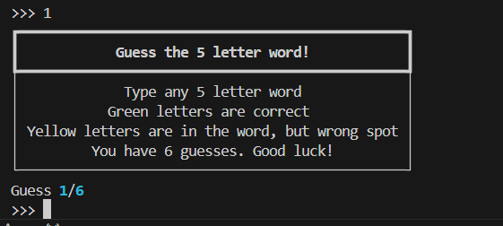

#### How To Play Option
Choose this to see the same game instructions:  

#### View My Scores Option
Choose this option to see your games played, and how many guesses each win took.
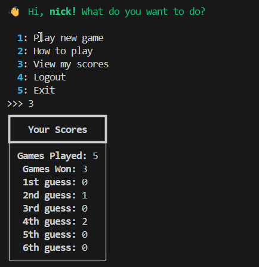

#### Logout Option
Choose this option to log out, returning to the main menu and allowing creation of a new user / login to another user.  
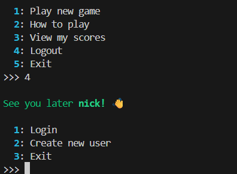